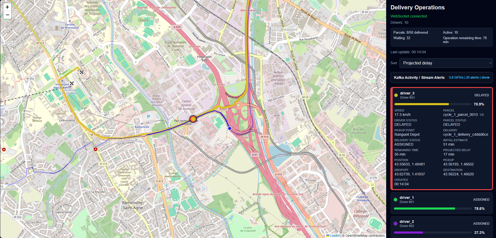
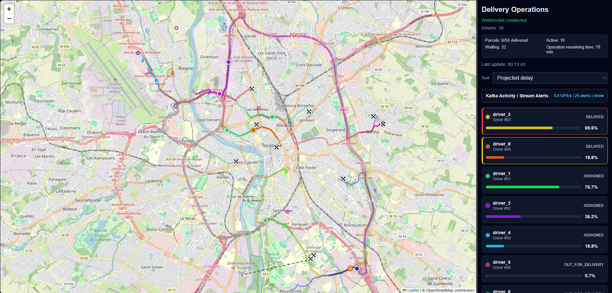
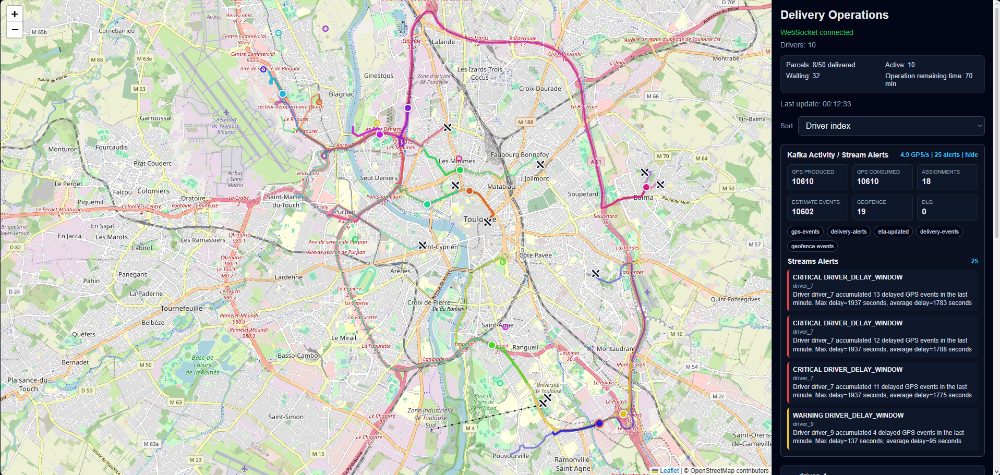
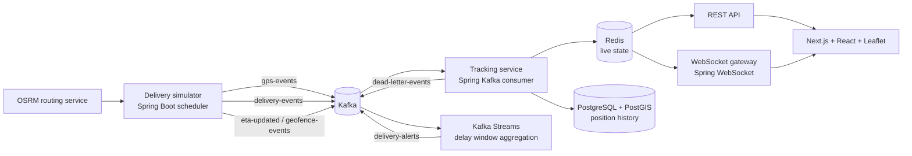

# Kafka Real-Time Delivery Operations Platform

Backend/event-driven portfolio project that simulates a same-day delivery operation in Toulouse, France.

The system generates drivers and parcels, dispatches deliveries, streams GPS events through Kafka, stores live state in Redis, persists position history in PostgreSQL/PostGIS, and exposes a real-time dashboard with Leaflet and WebSocket updates.

## What It Demonstrates

- Event-driven backend design with Kafka topics and JSON events.
- Kafka Streams delay-window aggregation on top of the raw GPS event stream.
- Real-time state projection from Kafka events into Redis.
- Geospatial history storage with PostgreSQL/PostGIS.
- WebSocket push updates for a live operations dashboard.
- Route-aware simulation using OSRM, with a fallback route generator.
- Delivery lifecycle transitions: assigned, pickup reached, in transit, delivered.
- Event robustness: validation, deduplication, out-of-order detection, dead-letter events.
- Integration testing with Testcontainers for Kafka, Redis and PostgreSQL/PostGIS.

## Current Demo Scope

- 10 simulated drivers.
- 50 parcels per delivery cycle.
- Each driver receives 5 parcels for the cycle.
- Drivers stop with status `FINISHED` when their queue is complete.
- A new 50-parcel cycle starts once all drivers are finished.
- Live dashboard shows driver positions, routes, pickups, dropoffs, speed, progress, ETA, delay, traffic and parcel status.
- Delay severity:
  - white: no delay;
  - yellow: delay between 0 and 5 minutes;
  - red: delay over 5 minutes.

## Screenshots

### Real-Time Map With Kafka Activity



The main dashboard shows live driver positions on a Leaflet map, pickup markers, road-based routes, and the Kafka monitoring panel. `Kafka Activity` exposes event throughput and topic activity, while `Streams Alerts` shows delay alerts produced by the Kafka Streams aggregation topology.

### Driver Ranking By Projected Delay



Drivers can be sorted by operational criteria such as projected delay, progress, speed, status, or last update. The compact driver list keeps the dashboard readable while still showing each driver's parcel status and delivery progress.

### Expanded Driver Details



Clicking a driver expands the card with detailed live state: speed, active parcel, pickup point, delivery status, initial estimate, remaining time, projected delay, position, pickup/dropoff coordinates, destination, and last update time. The same click also focuses the map on that driver.

## Architecture



## Tech Stack

| Area | Technology |
| --- | --- |
| Backend | Java 21, Spring Boot, Spring Kafka, Spring WebSocket |
| Frontend | TypeScript, Next.js, React, Leaflet |
| Messaging | Kafka |
| Stream processing | Kafka Streams |
| Live state | Redis |
| History | PostgreSQL, PostGIS, Hibernate Spatial |
| Routing | OSRM |
| Local infra | Docker Compose |
| Testing | JUnit, Spring Boot Test, Testcontainers |
| Observability hooks | Spring Actuator, Prometheus metrics endpoint |

## Repository Layout

```text
.
+-- backend/              # Spring Boot backend, simulator, Kafka consumers, Redis/PostGIS projection
+-- frontend/             # Next.js dashboard
+-- infra/osrm/           # OSRM data location and setup notes
+-- scripts/              # OSRM preprocessing scripts
`-- docker-compose.yml    # Local platform
```

## Prerequisites

- Docker Desktop.
- Git.
- PowerShell on Windows, or Bash on Linux/macOS.
- Optional for local non-Docker development:
  - Java 21
  - Maven 3.9+
  - Node.js 22+

## First-Time Setup

OSRM needs preprocessed routing files before the full stack can start with real road routes.

On Windows PowerShell:

```powershell
.\scripts\setup-osrm.ps1
```

On Bash:

```bash
./scripts/setup-osrm.sh
```

This downloads an OSM extract and creates files under:

```text
infra/osrm/data/
```

The generated OSRM files are intentionally ignored by Git because they are large.

## Run The Full Demo

Start everything:

```bash
docker compose up -d --build
```

Open:

- Dashboard: http://localhost:3000
- Backend health: http://localhost:8080/actuator/health
- Kafka UI: http://localhost:8081
- Prometheus metrics endpoint: http://localhost:8080/actuator/prometheus

Stop everything:

```bash
docker compose down
```

Reset local data:

```bash
docker compose down -v
```

## Quick Verification

Backend health:

```bash
curl http://localhost:8080/actuator/health
```

Live drivers:

```bash
curl http://localhost:8080/api/drivers/live
```

Expected live state after startup:

- 10 drivers.
- `totalParcels = 50`.
- `driverAssignedParcels = 5` per driver.
- `activeParcels` starts around 10.
- `pendingParcels` starts around 40 once each driver has one active parcel.
- Driver positions update every few seconds.

Kafka topics to inspect in Kafka UI:

- `gps-events`
- `delivery-events`
- `driver-events`
- `eta-updated`
- `geofence-events`
- `delivery-alerts`
- `dead-letter-events`

Redis keys to inspect:

- `driver:{driverId}:state`
- `driver:{driverId}:last-event`
- `processed:event:{eventId}`

PostgreSQL table to inspect:

- `driver_positions`

Example:

```bash
docker exec -it delivery-postgres psql -U delivery -d delivery
```

```sql
select driver_id, delivery_id, speed_kmh, event_timestamp
from driver_positions
order by event_timestamp desc
limit 10;
```

## Demo Walkthrough

1. Open http://localhost:3000.
2. Confirm 10 drivers appear on the map.
3. Watch driver markers move along road-based routes.
4. Check pickup markers, dropoff markers and route polylines.
5. Use the right panel to sort by delay, progress, speed or status.
6. Click a driver in the list to focus the map on that driver.
7. Click the same driver again to unselect and return to the default map view.
8. Wait for traffic effects to create small delays.
9. Confirm delay coloring:
   - yellow for delays up to 5 minutes;
   - red for delays over 5 minutes.
10. Check the `Kafka Activity` panel in the dashboard.
11. Confirm `gps-events` counters increase and recently touched topics update.
12. Wait for a delayed driver and confirm a `Streams Alerts` item appears.
13. Open Kafka UI and inspect `gps-events`, `delivery-events`, `eta-updated`, `geofence-events` and `delivery-alerts`.
14. Query PostgreSQL to confirm position history is being persisted.

## Event Flow

1. The simulator assigns parcels to drivers and publishes assignment events.
2. Drivers move along OSRM routes or fallback multi-segment routes.
3. GPS events are published to `gps-events`.
4. A Spring Kafka tracking consumer validates events.
5. Invalid events go to `dead-letter-events`.
6. Duplicate events are ignored using Redis `processed:event:{eventId}` keys.
7. Out-of-order events are detected using each driver's last sequence/timestamp state.
8. Valid events update Redis live state.
9. Valid events are persisted to PostgreSQL/PostGIS.
10. A Kafka Streams topology consumes `gps-events`, groups delayed events by driver in one-minute windows, and publishes aggregated delay alerts to `delivery-alerts`.
11. The dashboard receives live state through WebSocket broadcasts.

## Kafka Architecture

The demo is built around Kafka as the central event backbone. The backend deliberately keeps the service count small, but the internal boundaries still follow an event-driven model:

| Topic | Producer | Consumer | Purpose |
| --- | --- | --- | --- |
| `gps-events` | Delivery simulator | Tracking consumer, Kafka Streams | Raw driver telemetry stream. |
| `delivery-events` | Delivery simulator | Kafka UI / future services | Delivery assignment lifecycle events. |
| `driver-events` | Reserved | Future services | Driver lifecycle events. |
| `eta-updated` | Delivery simulator | Kafka UI / future services | ETA updates generated during movement. |
| `geofence-events` | Delivery simulator | Kafka UI / future services | Pickup/dropoff arrival events. |
| `delivery-alerts` | Kafka Streams | Dashboard alert consumer | Aggregated operational alerts. |
| `dead-letter-events` | Tracking consumer | Kafka UI / future replay tooling | Invalid or rejected input events. |

The dashboard exposes this Kafka activity directly:

- GPS produced and consumed counters.
- GPS events per second over the last 30 seconds.
- Delivery assignment, ETA, geofence, alert and DLQ counters.
- Recently touched Kafka topics.
- Recent Kafka Streams alerts from `delivery-alerts`.

## Kafka Streams Topology

The project includes a focused Kafka Streams topology:

```text
gps-events
  -> filter events with delaySeconds > 0
  -> key by driverId
  -> one-minute window aggregation
  -> count delayed GPS events, max delay, average delay
  -> publish DRIVER_DELAY_WINDOW alerts to delivery-alerts
```

Alert rules:

- `WARNING`: at least 3 delayed GPS events for the same driver in a one-minute window.
- `CRITICAL`: max delay reaches 5 minutes or more in the window.

This keeps the stream processing scope small but meaningful: the raw telemetry stream is transformed into operational delay alerts without querying Redis or PostgreSQL.

### Example Events

`gps-events`:

```json
{
  "eventId": "evt_001",
  "driverId": "driver_4",
  "deliveryId": "delivery_18",
  "parcelId": "parcel_18",
  "lat": 43.6045,
  "lng": 1.444,
  "speedKmh": 27.5,
  "status": "DRIVING",
  "deliveryStatus": "IN_TRANSIT",
  "parcelStatus": "OUT_FOR_DELIVERY",
  "currentEtaSeconds": 420,
  "delaySeconds": 90,
  "eventTimestamp": "2026-07-06T10:15:00Z",
  "producedAt": "2026-07-06T10:15:01Z",
  "sequenceNumber": 123
}
```

`delivery-alerts`:

```json
{
  "eventId": "delay-window-driver_4-1783332900000-3",
  "alertType": "DRIVER_DELAY_WINDOW",
  "driverId": "driver_4",
  "deliveryId": "delivery_18",
  "message": "Driver driver_4 accumulated 3 delayed GPS events in the last minute. Max delay=180 seconds, average delay=150 seconds",
  "severity": "WARNING",
  "eventTimestamp": "2026-07-06T10:16:00Z"
}
```

`dead-letter-events`:

```json
{
  "eventId": "dlq_001",
  "originalEventId": "evt_invalid_001",
  "sourceTopic": "gps-events",
  "reason": "Invalid GPS coordinates",
  "payload": "{...}",
  "eventTimestamp": "2026-07-06T10:17:00Z"
}
```

## Data Model

The current persisted history focuses on driver positions:

- event id
- driver id
- delivery id
- geospatial point
- speed
- driver status
- event timestamp
- produced timestamp
- sequence number

Live Redis state contains the richer dashboard projection: parcel id, pickup/dropoff, route geometry, ETA, delay, traffic, progress and cycle counters.

## Tests

Run backend tests with Docker/Testcontainers:

```bash
docker run --rm \
  -e TESTCONTAINERS_RYUK_DISABLED=true \
  -e TESTCONTAINERS_HOST_OVERRIDE=host.docker.internal \
  -v /var/run/docker.sock:/var/run/docker.sock \
  -v ${PWD}:/app \
  -w /app/backend \
  -v delivery-maven-cache:/root/.m2 \
  maven:3.9.9-eclipse-temurin-21 mvn -B test
```

On Windows PowerShell:

```powershell
docker run --rm `
  -e TESTCONTAINERS_RYUK_DISABLED=true `
  -e TESTCONTAINERS_HOST_OVERRIDE=host.docker.internal `
  -v /var/run/docker.sock:/var/run/docker.sock `
  -v ${PWD}:/app `
  -w /app/backend `
  -v delivery-maven-cache:/root/.m2 `
  maven:3.9.9-eclipse-temurin-21 mvn -B test
```

The test suite includes:

- Kafka production/consumption integration test.
- Kafka consumer projection test into PostgreSQL and Redis.
- Kafka Streams topology tests from `gps-events` to `delivery-alerts` with `TopologyTestDriver`.

Build the full application:

```bash
docker compose build backend frontend
```

## Design Choices

- One backend service is used for the MVP instead of splitting into many microservices. This keeps the project easier to run locally while still showing Kafka-based event flow.
- Redis stores live state only. PostgreSQL/PostGIS stores historical positions.
- OSRM provides realistic route geometry. If OSRM is unavailable, the simulator can still generate multi-segment fallback routes.
- Delivery assignment is intentionally simple: parcels are distributed across drivers for a fixed cycle. This avoids turning the MVP into a complex routing optimization project.
- The dashboard is operational rather than marketing-oriented: dense state, sorting, map interaction and live metrics.

## Known Limitations

- Kafka Streams is intentionally limited to delay-window alert aggregation. Most state projection is still handled by Spring Kafka consumers for MVP simplicity.
- Prometheus is exposed by the backend, but Grafana dashboards are not yet included.
- Replay of a completed delivery is not implemented yet.
- Assignment optimization is intentionally basic for the MVP.

## Possible Next Steps

- Add Grafana dashboards for event throughput, DLQ count and processing latency.
- Add more Kafka Streams windows for out-of-order handling and cross-driver aggregate delay metrics.
- Add replay by delivery id from persisted history or compacted Kafka events.
- Add a real parcel detail page.
- Add a short demo video/GIF to the README.
- Add CI for backend tests and frontend build.
